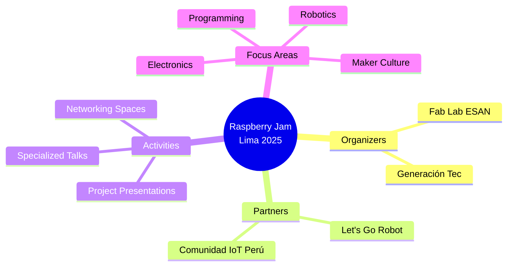
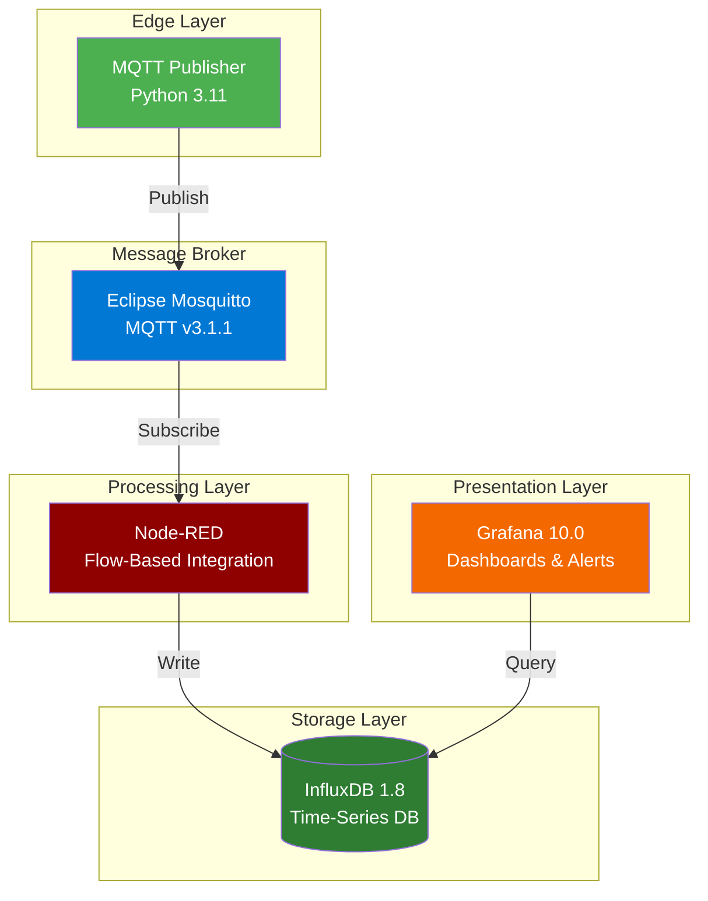
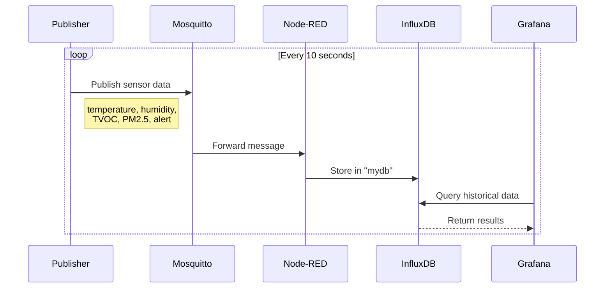

# ComIoTPeru - RPIJAM

## Environmental IoT Monitoring System

A fully containerized IoT solution for real-time environmental monitoring, built with industry-standard technologies and deployed on Raspberry Pi. This project demonstrates end-to-end IoT architecture from sensor data simulation to interactive dashboards.

---

<p align="center">
  
</p>

<h1 align="center">👋 Hi, I'm Alvaro Martín</h1>

<p align="center">
  <strong>🚀 Co-founder of Comunidad IoT Perú | IoT Developer</strong>
</p>

<p align="center">
  <a href="https://alvaro-martin.github.io/personal-site/">🌐 Personal Site</a> ·
  <a href="https://github.com/alvaro-martin">💻 GitHub</a> ·
  <a href="https://linkedin.com/in/almartinuni">🔗 LinkedIn</a> ·
  <a href="https://iotcomunidad.pe">🌍 Comunidad IoT Perú</a>
</p>

---

## The Story

> I built this IoT monitoring system for **Raspberry Jam Lima 2025**, an event celebrating innovation and maker culture with Raspberry Pi. As co-founder of **Comunidad IoT Perú**, I wanted to create a practical demonstration of how edge computing and IoT technologies can work together in a real-world scenario.
>
> Instead of a simple sensor demo, I designed a complete data pipeline: from simulated environmental sensors to interactive dashboards — all containerized and running on a Raspberry Pi. The stack combines **Docker** for orchestration, **MQTT** for lightweight messaging, **InfluxDB** for time-series storage, **Node-RED** for flow-based integration, and **Grafana** for visualization.
>
> This project showcases the power of open-source IoT technologies and the maker community in Peru. 🤖✨

---

## About the Event

This project was developed for **Raspberry Jam Lima 2025**, an open and collaborative event celebrating creativity, learning, and technological innovation with Raspberry Pi.



| Detail | Information |
|--------|-------------|
| **Event** | Raspberry Jam Lima 2025 |
| **Date** | Saturday, July 12, 2025 |
| **Venue** | Universidad ESAN, Lima, Perú |
| **Organizers** | Fab Lab ESAN, Generación Tec |
| **Partners** | Let's Go Robot, Comunidad IoT Perú |

The event brings together enthusiasts, students, and entrepreneurs using Raspberry Pi to share projects, ideas, and experiences related to programming, robotics, electronics, and maker culture.

### Comunidad IoT Perú

This project is developed by **[Comunidad IoT Perú](https://iotcomunidad.pe)**, a community dedicated to promoting IoT education and innovation in Peru. As co-founders, we aim to empower individuals with practical knowledge of connected technologies and edge computing.

---

## Technologies & Skills Demonstrated

| Category | Technologies |
|----------|--------------|
| **Containerization** | Docker, Docker Compose |
| **Message Broker** | Eclipse Mosquitto (MQTT v3.1.1) |
| **Time-Series Database** | InfluxDB 1.8 |
| **Flow-Based Programming** | Node-RED 3.1 |
| **Data Visualization** | Grafana 10.0 |
| **Programming** | Python 3.11 |
| **Protocols** | MQTT, WebSocket, HTTP |
| **Platform** | Raspberry Pi (ARM) |

> **Context**: Developed as a live demonstration for Raspberry Jam Lima 2025, showcasing real-world IoT implementation on edge devices.

---

## Architecture Overview



---

## Data Flow



---

## Sensor Metrics

| Metric | Description | Range | Unit |
|--------|-------------|-------|------|
| `temperature` | Ambient temperature | 20 - 35 | °C |
| `humidity` | Relative humidity | 30 - 90 | % |
| `TVOC` | Total Volatile Organic Compounds | 0.0 - 5.0 | ppm |
| `PM2.5` | Fine particulate matter | 0 - 20 | µg/m³ |
| `alert` | Alert status flag | 0 or 1 | - |

---

## Project Structure

```
ComIoTPeru-RPIJAM/
├── compose.yml                 # Docker Compose orchestration
├── mqtt-publisher/
│   ├── Dockerfile             # Python container definition
│   └── mqtt_publisher.py      # Sensor data simulator
├── mosquitto/
│   └── config/
│       └── mosquitto.conf     # MQTT broker configuration
├── nodered/
│   └── data/                  # Node-RED flows & settings
├── influxdb/                  # InfluxDB data persistence
├── grafana/                   # Grafana dashboards & config
├── install_docker_rpi.sh      # Raspberry Pi setup script
└── fix_permissions_nodered_grafana.sh  # Permission fix utility
```

---

## Services & Ports

| Service | Container | Port | Protocol |
|---------|-----------|------|----------|
| MQTT Broker | mosquitto | 1883 | MQTT |
| MQTT WebSocket | mosquitto | 9001 | WebSocket |
| Node-RED | nodered | 1880 | HTTP |
| InfluxDB | influxdb | 8086 | HTTP |
| Grafana | grafana | 3000 | HTTP |

---

## Getting Started

### Prerequisites
- Raspberry Pi (or any Docker-compatible system)
- Docker & Docker Compose installed

### Quick Start

```bash
# Clone the repository
git clone https://github.com/alvaro-martin/ComIoTPeru-RPIJAM.git
cd ComIoTPeru-RPIJAM

# Start all services
docker compose up -d

# View logs
docker compose logs -f
```

### Access Services

| Service | URL | Credentials |
|---------|-----|-------------|
| Node-RED | http://localhost:1880 | - |
| Grafana | http://localhost:3000 | admin / admin123 |
| InfluxDB | http://localhost:8086 | admin / admin123 |

---

## Node-RED Configuration

1. Add an **MQTT In** node (network component):
   - Server: `mosquitto:1883`
   - Action: Subscribe to single topic
   - Topic: `commands/vaper`
   - QoS: `2`
   - Protocol: MQTT V3.1.1

2. Install the InfluxDB plugin, then add an **InfluxDB Out** node (storage component):
   - Name: `influxdb/vaper`
   - Server: `[v1.8-flux] influxdb`
   - Database: `mydb`
   - Measurement: `commands/vaper`

3. Connect the MQTT In node to the InfluxDB Out node.

4. Add a **Debug** node (common component) connected to the MQTT In node for monitoring.

5. Click **Deploy** to activate the flow.

### InfluxDB Server Settings (Node-RED)
- Name: `influxdb`
- Version: `1.8-flux`
- URL: `http://influxdb:8086`
- Username: `admin`
- Password: `admin123`

---

## Grafana Configuration

1. Navigate to **Data Sources** → **Add data source** → **InfluxDB**

2. Configure:
   | Setting | Value |
   |---------|-------|
   | Name | InfluxDB |
   | Query Language | InfluxQL |
   | URL | http://influxdb:8086 |
   | Auth | Basic Auth |
   | User | admin |
   | Password | admin123 |
   | Database | mydb |
   | HTTP Method | POST |

3. Click **Save & Test**

### Sample Queries

```sql
-- Temperature over time
SELECT mean("temperature") FROM "autogen"."commands/vaper"
WHERE $timeFilter GROUP BY time($__interval) fill(null)

-- Humidity over time
SELECT mean("humidity") FROM "autogen"."commands/vaper"
WHERE $timeFilter GROUP BY time($__interval) fill(null)

-- PM2.5 levels
SELECT mean("PM2.5") FROM "autogen"."commands/vaper"
WHERE $timeFilter GROUP BY time($__interval) fill(null)

-- TVOC concentration
SELECT mean("TVOC") FROM "autogen"."commands/vaper"
WHERE $timeFilter GROUP BY time($__interval) fill(null)

-- Alert status
SELECT mean("alert") FROM "autogen"."commands/vaper"
WHERE $timeFilter GROUP BY time($__interval) fill(null)
```

---

## Key Learnings & Skills

- **IoT Architecture**: Designed a complete edge-to-cloud data pipeline
- **Container Orchestration**: Multi-service Docker Compose deployment
- **Message-Driven Architecture**: Decoupled services via MQTT pub/sub pattern
- **Time-Series Data Management**: Efficient storage and querying with InfluxDB
- **Real-Time Monitoring**: Live dashboards with Grafana visualization
- **Edge Computing**: Optimized for Raspberry Pi deployment
- **DevOps Practices**: Infrastructure as Code, automated provisioning
- **Community Engagement**: Presented at Raspberry Jam Lima 2025 with Comunidad IoT Perú

---

## Event Details

This project was showcased at **Raspberry Jam Lima 2025** at Universidad ESAN, organized by Fab Lab ESAN and Generación Tec, with support from Let's Go Robot and Comunidad IoT Perú.

For more information about the event: [Raspberry Jam Lima 2025](https://fablab.esan.edu.pe/comunidad/eventos/raspberry-jam-lima-2025/)

---

## Contact

**Alvaro Martín** - Co-founder, Comunidad IoT Perú

<p align="center">
  <a href="https://alvaro-martin.github.io/personal-site/">🌐 Portfolio</a> ·
  <a href="https://github.com/alvaro-martin">💻 GitHub</a> ·
  <a href="https://linkedin.com/in/almartinuni">🔗 LinkedIn</a> ·
  <a href="https://iotcomunidad.pe">🌍 Comunidad IoT Perú</a>
</p>
